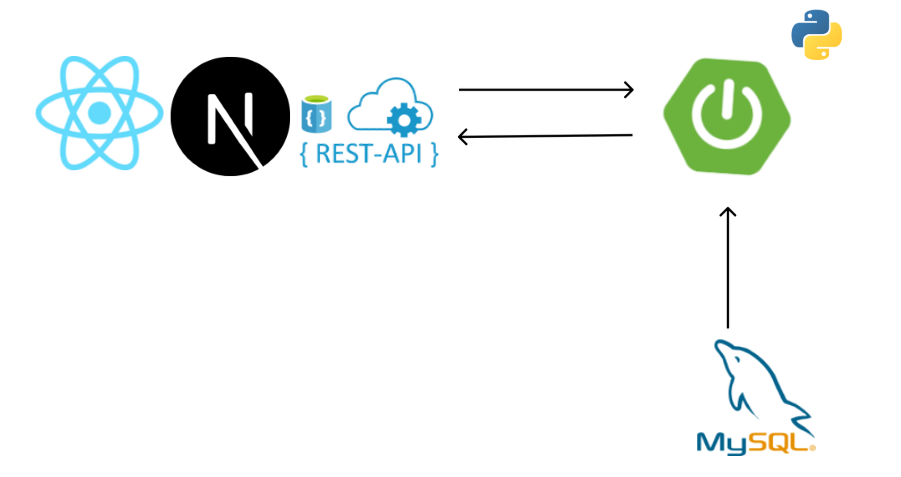

# [경주의 밤]

### 해당 서비스는 2024 경주 지역문제 해결 해커톤 [자바조아]의 프로젝트 입니다.

---
## 서비스 소개
### [경주의 밤]
- [경주의 밤]은 경주 여행객들에게 더 나은 숙박, 캠핑, 식자재 조달을 제공해주는 서비스입니다.
- [경주의 밤]을 통해 더 나은 경주 여행을 경험해보세요
- [경주의 밤]에서 제공하는 다양한 이벤트에 참여하고 지역상품권을 받아가세요

---
## 기능

- AI심층 분석을 통해 사용자에게 적합한 메뉴를 추천
- 각 캠핑장, 숙소와 제휴를 맺어 사용자에게 더 낮은 가격에 숙박 서비스를 제공
- 식자재의 유통과정을 생략하여 소비자들에게 직접 배달하면서 더 낮은 가격으로 소비자들에게 식자재 제공 및 배달 일자리 창출 가능 

---
## 서비스 아키텍처

---
## 사용 기술
| **Category**         | **Technologies** |
|----------------------|-------------|
| **Frontend**         | nextjs      |
| **Backend**          | springboot  |
| **devops**           | localhost   |
| **Others**           | Github, Notion, Figma |

---
## 팀원 소개
| **권민지**            | **전상은** | **전형주** | **김이현** |
|----------------------|----------|-----------|---------|
| 팀장(Leader),Fullstack| Fullstack|     AI    | Fullstack|
